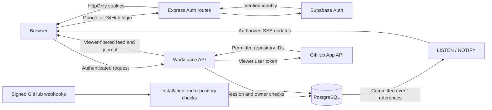

# Architecture

ship.live is a React interface and Express API backed by PostgreSQL, with Supabase Auth for Google/GitHub sign-in. A separate GitHub App provides repository activity. Production runs as one Node.js service; Vite is separate only during development. No Redis service or separate worker is required.

## Data flow

## Identity and session boundary

`server/auth.ts` owns the Supabase PKCE start/callback, session inspection, logout, and mutation checks. A login transaction is random, browser-bound, expiring, and consumed atomically in PostgreSQL. Only Google and GitHub login providers are exposed. Exact `APP_URL` configuration controls redirects and mutation Origin checks.

The callback verifies the Supabase user and stores a profile keyed by that user's UUID. Supabase manages identity linking, including its automatic matching-email behavior; ship.live does not add another email-based linking layer. GitHub data connection is separate from login, so a Google user can write private notes before connecting GitHub.

Supabase access/refresh credentials live in host-only HttpOnly cookies. Login-provider tokens are removed before final cookie writes. An additional opaque app cookie has only its SHA-256 hash stored in PostgreSQL, with a seven-day expiry. This shared guard prevents replaying a still-valid Supabase token after local logout. Session creation rotates the prior app session. There is no browser Supabase client or localStorage token persistence.

`authenticate` verifies the current Supabase user and matches it to the shared app session. `requireMutation` also requires the exact Origin and a session-bound CSRF token. `assertActive` rechecks shared revocation and the original Supabase credential during long-running work/SSE; an expired stream closes so a new HTTP request can refresh cookies. Responses that set or return session state are private and not cacheable.

## Workspaces and repository permissions

The personal workspace belongs to one authenticated UUID. Manual notes have owner-only read/write/delete access. Note events support progress that is not represented by a GitHub event; their XP is zero.

A connected GitHub identity is established with a separate GitHub App user-authorization flow, bound to the app user/session with state and PKCE. Tokens are encrypted with authenticated encryption and an environment key. Refresh updates are serialized in PostgreSQL because GitHub rotates both access and refresh tokens. Replacing the connected GitHub account invalidates prior workspace memberships/connections.

Each new GitHub authorization has a distinct database generation. Stored repository access is bound to it, and installation attachment checks it inside a transaction. A callback claims its OAuth flow once, retains that claim during code exchange, and commits credentials only while both the claim and app session remain valid. Disconnect invalidates pending claims and workspace associations; a callback already exchanging its code cannot restore that connection. An uncertain token refresh also clears those associations. These operations lock the user row before connection rows so concurrent replicas apply them in order.

GitHub App installations can belong to a personal account or organization. Installation choices and viewer repository grants are obtained with that person's **user token**, not the App's broader installation token. Permissions are the intersection of App access and user access. Returned installation IDs are verified; setup query parameters alone never establish ownership.

Repository access is read from GitHub only when a person connects GitHub or an installation, chooses **Refresh**, or runs **Sync GitHub activity**. The result is stored per user and authorization generation in `ship_live_github_access`. Feed, wall, health, discovery, share, and live-stream reads authorize from that snapshot without calling GitHub, so they keep working through GitHub outages and rate limits. `installation_repositories` webhooks narrow every viewer's snapshot immediately; installation suspension/removal and authorization revocation apply through their lifecycle webhooks. With the read-only organization Members permission, `organization`, `membership`, `team`, and `member` webhooks identify affected viewers. Removals first drop the named repository, or all access for a removed organization or team member, then those viewers' access is recomputed in the background with their stored user tokens, four refreshes at a time per process. Every narrowing bumps the viewer's `access_version`; a refresh that read GitHub under an older version is discarded and read again, so it cannot restore access removed in the meantime. Changes GitHub does not announce, such as an organization's base permission, and organizations that have not approved Members apply at the next refresh or sync. An authorization without a snapshot gets one automatic refresh, retried at most every 15 minutes per process.

Team membership in ship.live is not an organization-wide private-data grant. Feed queries filter immutable repository IDs before applying the event limit. Metrics, repository labels, and search operate on that filtered collection. A viewer who loses access does not receive stored private events as a fallback. Personal journals are never shared. Team dashboards support explicit, expiring read-only links as described below.

## Dashboard sharing

`server/share-app.ts` and `server/share-store.ts` provide a separate read-only bearer capability. Authenticated team members can create, inspect, rotate, and revoke their own link. Mutations retain the normal Origin, CSRF, membership, session, and synced repository access checks. There is one record per creator/workspace, with a pinned installation, GitHub authorization generation, repository IDs, and a selected lifetime from 1 hour through 10 years. The **No expiration** option stores a 100-year expiry while preserving the same rotation and revocation path.

Tokens contain 32 random bytes; PostgreSQL stores only their SHA-256 hashes. Creation returns the token once. The UI retains it only in memory and offers rotation if it no longer has the secret. Links use `/share#token`; the browser sends the token in `x-dashboard-share`, keeping it out of request URLs and referrers. Shared requests omit account cookies, return `no-store`, and expose neither notes nor event bodies. Anyone holding a valid link can see contributor names, GitHub activity titles, repository names, and XP from the pinned scope.

## Engineering utilities wall

Pulse, the team's main view, offers Overview, Review Radar, Release Pulse, Service Health, and Leaderboard scenes as tabs; Overview also lists repositories by this week's activity. The main navigation holds only Pulse and Service Health: the Live feed, milestones, and contributor table open from Pulse and lead back to it. Review Radar is always offered and Service Health whenever health data is available, each with an empty state; Release Pulse appears once GitHub reports deployments. The chosen scene stays put unless the viewer turns on **Auto-slide**, which starts on for signed-out visitors and the fullscreen wall display while dashboard animation is on, and pauses while the pointer is over the wall. **Arrange tabs** hides and reorders scenes per workspace; the order and visibility are stored only in that browser's localStorage, and at least one tab stays visible. Leaderboard and Team rows open a contributor profile computed in the browser from the same received events and credit rules as the weekly board; it adds no server data. GitHub `check_run`, commit `status`, `workflow_run`, `deployment`, and `deployment_status` webhooks feed a separate current-state store keyed by installation, repository, commit SHA, and signal identity. The app stores bounded names, states, timestamps, and GitHub URLs; it excludes raw payloads, logs, annotations, and source code. Signed webhook updates notify connected wall clients through the existing PostgreSQL-backed SSE path.

Review Radar derives attention from open non-draft pull requests, latest checks, and reviews. Release Pulse renders only deployment stages GitHub reports. Service Health remains the runtime signal. Attention Mode stops auto-slide for down services, failed deployments, or failed CI and, when auto-slide is on, shows the affected scene; it then emits one recovery moment. First snapshots remain silent, and choosing a tab restarts the auto-slide interval. No mission, ticket, assignment, or messaging workflow is created.

Reads intersect pinned repository IDs with the creator’s synced repository access, checking the persisted capability again after the data read. Newly granted repositories never widen a distributed link. Disconnect, changed authorization generation, removed membership, installation suspension, expiry, rotation, or revocation deny access. No session impersonation is used: links intentionally outlive the creator’s login session until their own expiry or revocation.

Rotation replaces the token atomically and notifies all replicas through PostgreSQL. Shared SSE streams send only refresh/revocation signals, revalidate access, and close at expiry. The client clears data on revocation, expiry, or failed verification and ignores in-flight stale responses. Polling revalidates every 15 seconds if live updates disconnect. Revocation prevents further access; it cannot recall content a viewer has already copied. Request and stream limits remain per process.

## GitHub ingestion

`server/github-app.ts` handles App OAuth, user/installations/repository lookup, token creation, and bounded recent-history reads. It uses fixed GitHub origins, read-only permissions, explicit timeouts, and complete pagination for access checks. An incomplete or failed permission listing replaces no stored access. Listings run only on explicit connect, refresh, and sync.

Recent synchronization examines a limited last-30-day history, in repository batches of 20: up to 100 PRs, 100 closed issues, 100 releases, and the first 100 reviews for up to 30 recently updated PRs per repository. This is a partial import; push activity begins with future webhooks. The API includes a completeness notice and failures rather than implying a full archive. Each repository records its last successful import in `ship_live_repository_sync`, timed by the database clock so every replica agrees. Later syncs resume from that point with a 15-minute overlap for late GitHub writes, so they read issues since then and reviews only for pull requests updated since then; a failed repository keeps its previous point. Stored events are deduplicated by canonical ID, so the overlap and webhook deliveries create no duplicates. Sync and the import after connecting an installation run in the background: the request returns `202`, and the outcome is recorded in `ship_live_sync_runs`, one row per workspace, which clients poll every few seconds while it runs. A request while a run is active joins it, and a run left running by a stopped process is reported as interrupted after an hour.

The webhook handler verifies HMAC over the raw body before interpreting an event. Installation and repository identity determine its storage scope. Lifecycle deliveries revoke user authorization, suspend/remove installations, and narrow stored access when repository selections change. Selection changes cannot rely solely on a removed-ID list because switching from all repositories to selected repositories may provide an empty list, so the handler prefers the installation's current selection, read with the installation token, and falls back to the removed list.

Normalized events store activity metadata, not cloned source files or raw webhook bodies. IDs identify the underlying PR, review, push, issue closure, or release where possible. Merges credit the PR author; reviews credit their author. Canonical issue reconciliation preserves the first closure timestamp so reopen/reclose does not create a later week's credit. Delivery IDs and event updates commit transactionally.

## PostgreSQL and realtime

The schema contains shared auth profiles/sessions/flows, encrypted GitHub grants, workspaces, notes, installation/repository associations, event history, and delivery deduplication. Startup runs versioned SQL migrations under an advisory lock. Database failure stops startup; the memory adapter exists only for isolated tests.

Application tables have RLS enabled and `PUBLIC`, `anon`, and `authenticated` grants revoked. They are backend-owned tables, without client Data API policies. Disable Supabase's unused Data API as an additional boundary. The server's owner role can bypass RLS, so parameterized SQL and explicit workspace/repository checks remain essential; database operators are trusted.

Each app process has a query pool and a dedicated session for PostgreSQL `LISTEN`. Committed webhook updates notify other instances using event references, not private titles. Each instance reads canonical records and authorizes its own stream clients. Notifications are transient; listener reconnects and browser polling recover from missed messages. There is no historical SSE replay cursor.

Use a direct connection or session pooler. A transaction pooler cannot preserve the listener session. Stored events and accepted deliveries do not expire automatically; the API/browser show a bounded latest-event view of up to 2,000 events per workspace. Retention, backups, and restore testing belong to the operator.

## Browser and visualization

`useFeed` loads the app session and authorized workspaces, polls the active feed, and reconciles SSE updates by event identity. Credentials and private records are not saved to localStorage. Changing account/workspace or losing authorization clears stale data; abort/generation checks prevent older requests from replacing the current view. Fictional demo activity stays separate.

The dashboard shows the complete current UTC week’s XP leaderboard beside recent activity. Rank changes animate by stable contributor identity, XP counts interpolate, and new awards are highlighted. Reduced-motion preferences and a motion toggle suppress animation. Search, repository filters, and replay remain in the Live feed page and do not change weekly recognition. Pausing the browser does not stop server ingestion.

The dashboard and shared view also show today’s UTC contribution count, a seven-day activity chart, and the closest incomplete weekly milestone. These insights use the same bot exclusion and deduplication rules as recognition; personal notes are excluded.

Live effects observe verified feed snapshots. The first snapshot is a silent baseline, including an empty workspace. Unseen human activity from the last two minutes receives a six-second feed highlight and XP notice; historical imports and repeated event IDs do not trigger effects. Merge and release notices can launch confetti, and newly reached milestones use a larger burst. Confetti has an eight-second cooldown. Hidden, paused, replaying, or syncing views consume updates silently instead of replaying effects on resume. Access loss clears notices alongside the feed. Reduced-motion preferences and the dashboard motion toggle suppress animation; a separate celebration toggle disables both notices and highlights. Demo activity simulation only updates browser memory.

Weekly recognition uses the visible authorized events and the current week beginning Monday at 00:00 UTC. Bots, duplicates, and invalid/future timestamps do not earn credit. Base XP is 50 for releases, 30 for merges into the repository default branch, 15 for merges into other branches, 15 for reviews, 10 for completed issues, 5 for opened PRs, 2 for each commit a push adds to the repository, and zero for journal notes. Commit counts use GitHub's distinct-commit marker, so branch creation and merge commits do not re-credit earlier commits. Merges without a reported base or default branch, including older stored events, keep default-branch credit. Review XP is capped per reviewer, repository, PR, and UTC day. Incomplete history and differing repository permissions can produce different totals.

## Modules

| Location                                                               | Responsibility                                                                    |
| ---------------------------------------------------------------------- | --------------------------------------------------------------------------------- |
| `shared/auth.ts`, `shared/workspaces.ts`, `shared/types.ts`            | Session, workspace, note, and event contracts.                                    |
| `server/index.ts`, `server/production.ts`                              | Environment validation, store startup, production serving, and shutdown.          |
| `server/auth.ts`                                                       | Supabase sign-in, shared session guard, secure cookies, CSRF.                     |
| `server/workspace-app.ts`                                              | Authenticated workspace routes, GitHub connection, webhooks, SSE.                 |
| `server/workspace-store.ts`                                            | Owner/repository-scoped persistence, notes, encrypted grants, OAuth transactions. |
| `server/github-app.ts`                                                 | GitHub App authentication, permission lookup, and recent activity import.         |
| `server/normalize.ts`                                                  | Canonical activity metadata from GitHub payloads.                                 |
| `server/postgres-store.ts`, `server/postgres-notifications.ts`         | Event reconciliation, migrations, durable history, database notifications.        |
| `server/migrations/`                                                   | Versioned auth, workspace, and event schemas.                                     |
| `src/hooks/useFeed.ts`                                                 | Session/workspace lifecycle, private feed synchronization, demo separation.       |
| `src/lib/activity.ts`, `src/lib/feedView.ts`, `src/lib/leaderboard.ts` | Recognition, view filtering, and rank changes.                                    |
| `src/App.tsx`, `src/components/LiveLeaderboard.tsx`                    | Journal/workspace UI and animated weekly leaderboard.                             |

The legacy `server/app.ts`, public-organization feed adapter, and JSON importer remain for compatibility tests and data recovery. The production entry point mounts only the authenticated workspace application. Old organization/key routes are not available, and legacy records are not automatically assigned to new accounts. See [upgrade notes](configuration.md#upgrading-an-existing-installation).

## Hosting

One Node service and PostgreSQL are sufficient. Supabase can provide both Auth and the database, with Railway hosting Node. Shared state supports replicas, while request counters and concurrent-stream limits remain process-local. An HTTPS origin, consistent secrets, database connection capacity, and access-controlled backups are operational requirements. [Configuration](configuration.md) and [Railway deployment](railway.md) describe setup and free-plan limitations.
