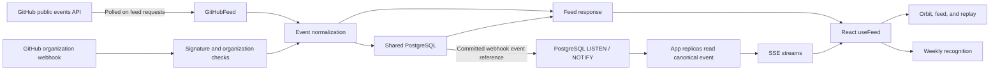

# Architecture

ship.live is a React application and an Express API backed by shared PostgreSQL. Vite runs separately in development; the production server serves the built frontend and API together. There is no separate worker, queue service, or hosted analytics dependency. Every API process requires `DATABASE_URL`; the in-memory store exists only for unit tests.

## Data flow

Only the configured organization's public polling results are persisted. Other public organizations are browsed through the server's memory cache. Webhooks belong to the one organization configured on that instance.

## Modules

| Location                                                                  | Responsibility                                                                                         |
| ------------------------------------------------------------------------- | ------------------------------------------------------------------------------------------------------ |
| [`shared/types.ts`](../shared/types.ts)                                   | `ActivityEvent` and `FeedResponse`, shared across frontend and backend.                                |
| [`server/index.ts`](../server/index.ts)                                   | Loads environment settings, opens the store, and starts Express.                                       |
| [`server/production.ts`](../server/production.ts)                         | Selects production mode before loading the server.                                                     |
| [`server/app.ts`](../server/app.ts)                                       | API routes, authorization, webhook processing, live connections, and request limits.                   |
| [`server/github.ts`](../server/github.ts)                                 | Public GitHub requests, ETag/poll interval caching, token isolation, and upstream errors.              |
| [`server/normalize.ts`](../server/normalize.ts)                           | Converts supported REST events and webhooks to the same event contract.                                |
| [`server/security.ts`](../server/security.ts)                             | Constant-time dashboard key comparison and HMAC webhook verification.                                  |
| [`server/store.ts`](../server/store.ts)                                   | Async store contract, canonical event selection, and an in-memory implementation for unit tests.       |
| [`server/postgres-store.ts`](../server/postgres-store.ts)                 | Shared event history, transactional deduplication, protection metadata, and schema migration.          |
| [`server/postgres-notifications.ts`](../server/postgres-notifications.ts) | Dedicated PostgreSQL listener, reconnection, and event-reference distribution.                         |
| [`server/migrations/`](../server/migrations/)                             | Versioned SQL schema.                                                                                  |
| [`server/migrate.ts`](../server/migrate.ts)                               | Optional explicit schema migration command; startup also migrates automatically.                       |
| [`server/import-json.ts`](../server/import-json.ts)                       | CLI for validating and importing a legacy JSON store without changing the source file.                 |
| [`server/legacy-import.ts`](../server/legacy-import.ts)                   | Whole-file validation of legacy events, delivery IDs, and protection metadata.                         |
| [`src/hooks/useFeed.ts`](../src/hooks/useFeed.ts)                         | Organization connection, demo state, polling, streaming, reconnects, and browser event reconciliation. |
| [`src/lib/feedView.ts`](../src/lib/feedView.ts)                           | Time windows, text/type/repository filters, and counts for the current view.                           |
| [`src/lib/activity.ts`](../src/lib/activity.ts)                           | UTC weekly recognition, XP eligibility, contributor ranking, and shared milestones.                    |
| [`src/lib/orbit.ts`](../src/lib/orbit.ts)                                 | Deterministic repository/event geometry and camera projection.                                         |
| [`src/components/OrbitScene.tsx`](../src/components/OrbitScene.tsx)       | Canvas rendering, picking, keyboard interaction, and motion lifecycle.                                 |
| [`src/App.tsx`](../src/App.tsx)                                           | Shared UI state, navigation, selected events, replay, dialogs, and display controls.                   |

## Ingestion and identity

Normalized events contain an ID, type, contributor, repository, title, and timestamp, with optional GitHub URL, number, and diff counts. REST and webhook paths share normalization so the same contribution can be reconciled across sources. Unsupported actions never become activity points.

IDs use the underlying contribution where possible: repository and PR number for merges, review ID for reviews, ref and head for pushes, issue number for closures, and release ID for releases. PR open and merge events are distinct. Merge credit belongs to the PR author; review credit belongs to the reviewer; release credit belongs to its author.

The store combines records by organization and event ID. Public polling preserves existing stored versions, while webhook updates can replace them. Issue closure merging keeps the earliest received closure timestamp, preventing a reopen/reclose cycle from moving its credit into a later week. The canonical stored event is read and emitted to viewers after a successful webhook transaction.

PostgreSQL enforces unique delivery IDs across the shared database and unique event IDs within each organization. Each accepted activity webhook writes its delivery ID, event, and protection metadata in one transaction. Organization row locks serialize canonical merges across processes. A rollback leaves no accepted delivery marker or partial event write. Event identity provides a second reconciliation layer.

All normalized stored events and accepted delivery IDs remain in PostgreSQL without automatic expiration. Feed queries and the browser are capped at the latest 2,000 events per organization. Older stored records are not accessible through the current timeline or a history API. Public API limits and periods without ingestion still leave gaps; persistence does not backfill GitHub history.

## Browser lifecycle

`useFeed` initializes fictional demo data only when no organization is remembered. A saved organization starts with an empty event list while connecting, so demo activity cannot appear under a real organization's name. The legacy `pulse.organization` local-storage key is retained for compatibility. Dashboard credentials stay in React memory.

The hook refreshes every 30 seconds and consumes `/api/events` through streaming `fetch`, which allows the dashboard key to be sent in a request header. Stream events and feed refreshes are merged by event ID, sorted, and capped. Disconnects retry; polling recovers stored events without requiring an SSE replay cursor. Connection generations and abort controllers keep stale responses from a canceled connection from replacing the active feed.

Live-update pause, visual-motion pause, and timeline replay are separate controls. Pausing live updates stops polling and the stream in that browser; it does not stop server webhook ingestion. Pausing motion freezes the sculpture while allowing live data to update. Replay freezes the displayed time interval and applies a cutoff; it does not fetch missing history or change team scores.

## View counts and recognition

Orbit and the feed share a trailing 24-hour, 7-day, or 30-day range, repository/type/text filters, and replay cutoff. These view counts include bot activity. The selected event is synchronized between the feed and sculpture.

Weekly recognition reads the received event collection independently of those view filters and uses the current week beginning Monday at 00:00 UTC. It excludes known bot login patterns, invalid/future timestamps, and duplicate IDs. Base XP is 50 for releases, 30 for merges, 15 for reviews, 10 for completed issues, 5 for opened PRs, and 0 for pushes. Review XP is capped once per reviewer, repository, PR number, and UTC day when the PR number is available; distinct review submissions remain visible in review counts.

Shared weekly targets are 30 merges, 40 reviews, and 5 releases. Event details display base XP, while contributor totals apply eligibility and review caps. These measures celebrate received work; limited upstream history and the browser's 2,000-event window can make them incomplete even when older events exist in PostgreSQL.

## Orbit rendering

Each supplied event becomes one selectable point. Its angle comes from its timestamp, its repository determines its lane, and small ID-based offsets keep simultaneous events distinct. Sorted repository names make geometry independent of delivery ordering. Neutral filaments draw repository paths and do not represent invented events.

The canvas projects the geometry into 2D with depth-based styling. Picking selects the underlying event; dragging and keyboard input change the camera. Idle movement is a bounded sway around the user's orientation. A conservative arrival effect applies only to unseen recent events timestamped after the scene mounted.

The parent chooses motion defaults from the reduced-motion preference and honors an explicit user playback choice. The renderer follows that state, stops animation offscreen or in a hidden document, and releases animation frames, observers, and listeners on unmount.

## Deployment boundary

Each process uses a PostgreSQL query pool and a separate session connection for `LISTEN`. A webhook transaction calls `pg_notify` with only its organization and event ID. PostgreSQL delivers that reference after commit; listening instances check access, read the canonical record, and send it to their own SSE clients. Private event titles and payloads are not copied into notification messages. The database retains normalized events, not raw webhook payloads.

Notifications are transient. The listener reconnects after a lost session, and regular browser polling reconciles missed events from durable storage. Neither PostgreSQL notifications nor the browser stream provide a historical replay cursor. The database endpoint must support a persistent session: use a direct connection or session-mode pooler, not a transaction-mode pooler.

Startup applies versioned SQL migrations under a transaction-scoped advisory lock so concurrent replicas do not race schema setup. An unavailable database or failed migration stops startup; there is no local JSON fallback. `/api/health` checks database connectivity. Shutdown closes live responses, the listener, and the query pool.

Every instance has one configured webhook organization. Replicas serving that organization must use the same database and GitHub/dashboard credentials. Instances configured for different organizations may share the database, but each instance authorizes protected feeds only for its own configured organization. A shared dashboard key is team access control, not user-level authorization or database-level tenant isolation.

Upstream caches, request counters, and SSE connection limits remain local to each process. Use deployment-level controls if limits must apply across replicas. See [Configuration and hosting](configuration.md) for setup, retention, reverse-proxy considerations, and importing the previous JSON store.
