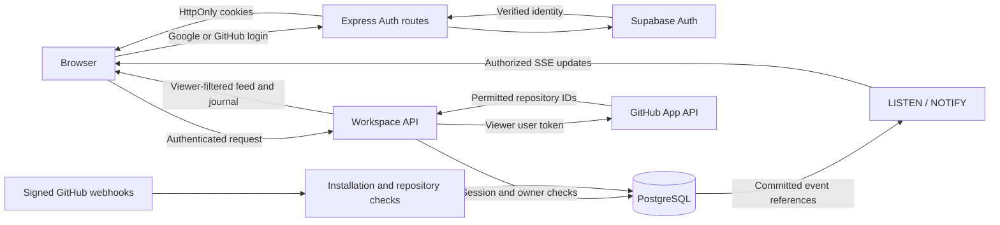

# Architecture

ship.live is a React interface and Express API backed by PostgreSQL, with Supabase Auth for Google/GitHub sign-in. A separate GitHub App provides repository activity. Production runs as one Node.js service; Vite is separate only during development. No Redis service or separate worker is required.

## Data flow

## Identity and session boundary

`server/auth.ts` owns the Supabase PKCE start/callback, session inspection, logout, and mutation checks. A login transaction is random, browser-bound, expiring, and consumed atomically in PostgreSQL. Only Google and GitHub login providers are exposed. Exact `APP_URL` configuration controls redirects and mutation Origin checks.

The callback verifies the Supabase user and stores a profile keyed by that user's UUID. Supabase manages identity linking, including its automatic matching-email behavior; ship.live does not add another email-based linking layer. GitHub data connection is separate from login, so a Google user can write private notes before connecting GitHub.

Supabase access/refresh credentials live in host-only HttpOnly cookies. Login-provider tokens are removed before final cookie writes. An additional opaque app cookie has only its SHA-256 hash stored in PostgreSQL, with a seven-day expiry. This shared guard prevents replaying a still-valid Supabase token after local logout. Session creation rotates the prior app session. There is no browser Supabase client or localStorage token persistence.

`authenticate` verifies the current Supabase user and matches it to the shared app session. `requireMutation` also requires the exact Origin and a session-bound CSRF token. `assertActive` rechecks shared revocation and the original Supabase credential during long-running work/SSE; an expired stream closes so a new HTTP request can refresh cookies. Responses that set or return session state are private and not cacheable.

## Workspaces and repository permissions

The personal workspace belongs to one authenticated UUID. Manual notes have owner-only read/write/delete access. Note events support progress that is not represented by a GitHub event; their XP is zero.

A connected GitHub identity is established with a separate GitHub App user-authorization flow, bound to the app user/session with state and PKCE. Tokens are encrypted with authenticated encryption and an environment key. Refresh updates are serialized in PostgreSQL because GitHub rotates both access and refresh tokens. Replacing the connected GitHub account invalidates prior workspace memberships/connections.

Each new GitHub authorization has a distinct database generation. Reads recheck it after remote requests, and installation attachment checks it inside a transaction. A callback claims its OAuth flow once, retains that claim during code exchange, and commits credentials only while both the claim and app session remain valid. Disconnect invalidates pending claims and workspace associations; a callback already exchanging its code cannot restore that connection. An uncertain token refresh also clears those associations. These operations lock the user row before connection rows so concurrent replicas apply them in order.

GitHub App installations can belong to a personal account or organization. Installation choices and viewer repository grants are obtained with that person's **user token**, not the App's broader installation token. Permissions are the intersection of App access and user access. Returned installation IDs are verified; setup query parameters alone never establish ownership.

Team membership in ship.live is not an organization-wide private-data grant. Feed queries filter immutable repository IDs before applying the event limit. Metrics, repository labels, and search operate on that filtered collection. A viewer who loses access does not receive stored private events as a fallback. Personal and team workspaces are not publicly shareable in this version.

## GitHub ingestion

`server/github-app.ts` handles App OAuth, user/installations/repository lookup, token creation, and bounded recent-history reads. It uses fixed GitHub origins, read-only permissions, explicit timeouts, and complete pagination for access checks. An incomplete or failed permission listing grants no partial cached access.

Recent synchronization examines a limited last-30-day history, in repository batches of 20: up to 100 PRs, 100 closed issues, 100 releases, and the first 100 reviews for up to 30 recently updated PRs per repository. This is a partial import; push activity begins with future webhooks. The API includes a completeness notice and failures rather than implying a full archive.

The webhook handler verifies HMAC over the raw body before interpreting an event. Installation and repository identity determine its storage scope. Lifecycle deliveries revoke user authorization, suspend/remove installations, and invalidate changed repository selections. Repository-selection changes cannot rely solely on a removed-ID list because switching from all repositories to selected repositories may provide an empty list.

Normalized events store activity metadata, not cloned source files or raw webhook bodies. IDs identify the underlying PR, review, push, issue closure, or release where possible. Merges credit the PR author; reviews credit their author. Canonical issue reconciliation preserves the first closure timestamp so reopen/reclose does not create a later week's credit. Delivery IDs and event updates commit transactionally.

## PostgreSQL and realtime

The schema contains shared auth profiles/sessions/flows, encrypted GitHub grants, workspaces, notes, installation/repository associations, event history, and delivery deduplication. Startup runs versioned SQL migrations under an advisory lock. Database failure stops startup; the memory adapter exists only for isolated tests.

Application tables have RLS enabled and `PUBLIC`, `anon`, and `authenticated` grants revoked. They are backend-owned tables, without client Data API policies. Disable Supabase's unused Data API as an additional boundary. The server's owner role can bypass RLS, so parameterized SQL and explicit workspace/repository checks remain essential; database operators are trusted.

Each app process has a query pool and a dedicated session for PostgreSQL `LISTEN`. Committed webhook updates notify other instances using event references, not private titles. Each instance reads canonical records and authorizes its own stream clients. Notifications are transient; listener reconnects and browser polling recover from missed messages. There is no historical SSE replay cursor.

Use a direct connection or session pooler. A transaction pooler cannot preserve the listener session. Stored events and accepted deliveries do not expire automatically; the API/browser show a bounded latest-event view of up to 2,000 events per workspace. Retention, backups, and restore testing belong to the operator.

## Browser and visualization

`useFeed` loads the app session and authorized workspaces, polls the active feed, and reconciles SSE updates by event identity. Credentials and private records are not saved to localStorage. Changing account/workspace or losing authorization clears stale data; abort/generation checks prevent older requests from replacing the current view. Fictional demo activity stays separate.

Orbit and the feed share time, text/type/repository filters, replay cutoff, and selected event. Motion pause, live-update pause, and replay are separate controls. Pausing the browser does not stop server ingestion. Canvas 2D projects deterministic event geometry, handles picking/keyboard navigation, respects reduced motion, and suspends animation when hidden.

Weekly recognition uses the visible authorized events and the current week beginning Monday at 00:00 UTC. Bots, duplicates, and invalid/future timestamps do not earn credit. Base XP is 50 for releases, 30 for merges, 15 for reviews, 10 for completed issues, 5 for opened PRs, and zero for pushes and journal notes. Review XP is capped per reviewer, repository, PR, and UTC day. Incomplete history and differing repository permissions can produce different totals.

## Modules

| Location                                                         | Responsibility                                                                    |
| ---------------------------------------------------------------- | --------------------------------------------------------------------------------- |
| `shared/auth.ts`, `shared/workspaces.ts`, `shared/types.ts`      | Session, workspace, note, and event contracts.                                    |
| `server/index.ts`, `server/production.ts`                        | Environment validation, store startup, production serving, and shutdown.          |
| `server/auth.ts`                                                 | Supabase sign-in, shared session guard, secure cookies, CSRF.                     |
| `server/workspace-app.ts`                                        | Authenticated workspace routes, GitHub connection, webhooks, SSE.                 |
| `server/workspace-store.ts`                                      | Owner/repository-scoped persistence, notes, encrypted grants, OAuth transactions. |
| `server/github-app.ts`                                           | GitHub App authentication, permission lookup, and recent activity import.         |
| `server/normalize.ts`                                            | Canonical activity metadata from GitHub payloads.                                 |
| `server/postgres-store.ts`, `server/postgres-notifications.ts`   | Event reconciliation, migrations, durable history, database notifications.        |
| `server/migrations/`                                             | Versioned auth, workspace, and event schemas.                                     |
| `src/hooks/useFeed.ts`                                           | Session/workspace lifecycle, private feed synchronization, demo separation.       |
| `src/lib/activity.ts`, `src/lib/feedView.ts`, `src/lib/orbit.ts` | Recognition, view filtering, and geometry.                                        |
| `src/App.tsx`, `src/components/OrbitScene.tsx`                   | Journal/workspace UI and interactive visualization.                               |

The legacy `server/app.ts`, public-organization feed adapter, and JSON importer remain for compatibility tests and data recovery. The production entry point mounts only the authenticated workspace application. Old organization/key routes are not available, and legacy records are not automatically assigned to new accounts. See [upgrade notes](configuration.md#upgrading-an-existing-installation).

## Hosting

One Node service and PostgreSQL are sufficient. Supabase can provide both Auth and the database, with Railway hosting Node. Shared state supports replicas, while request counters and concurrent-stream limits remain process-local. An HTTPS origin, consistent secrets, database connection capacity, and access-controlled backups are operational requirements. [Configuration](configuration.md) and [Railway deployment](railway.md) describe setup and free-plan limitations.
