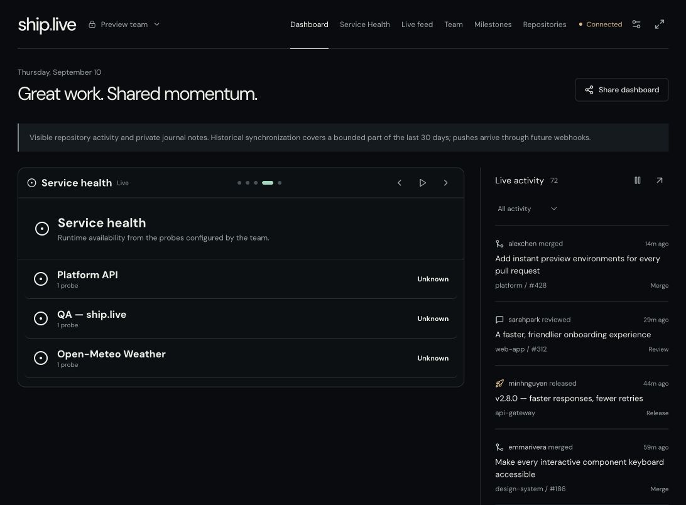
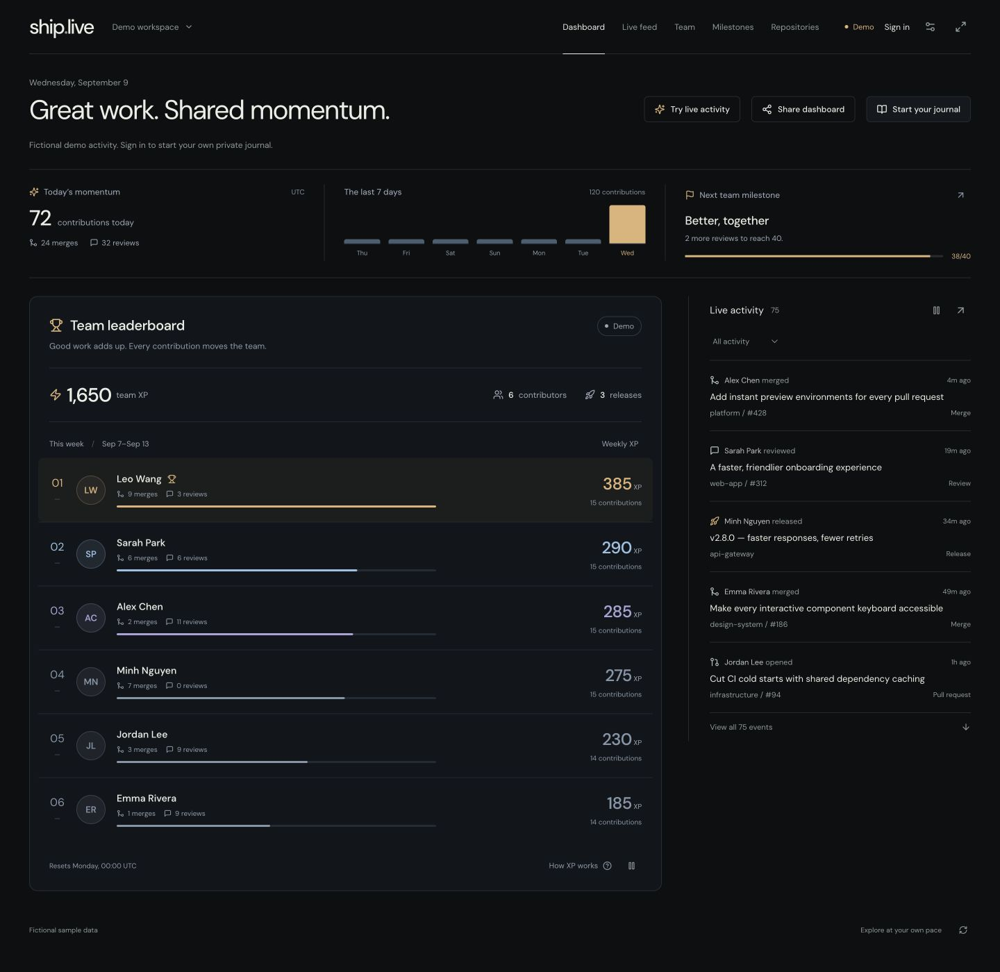
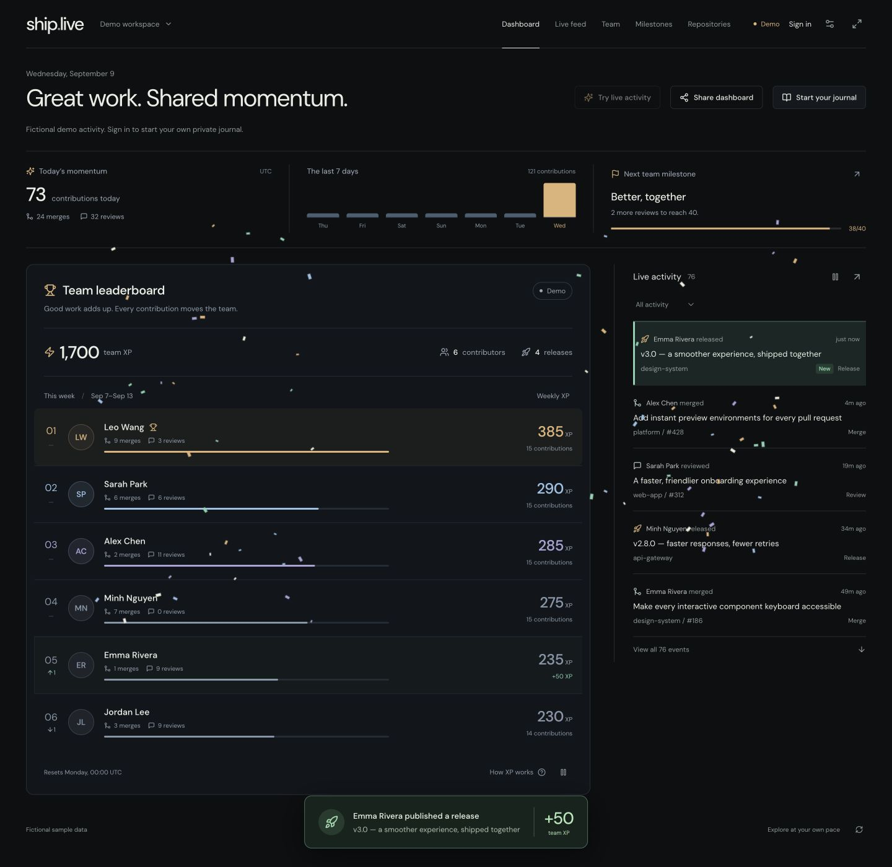
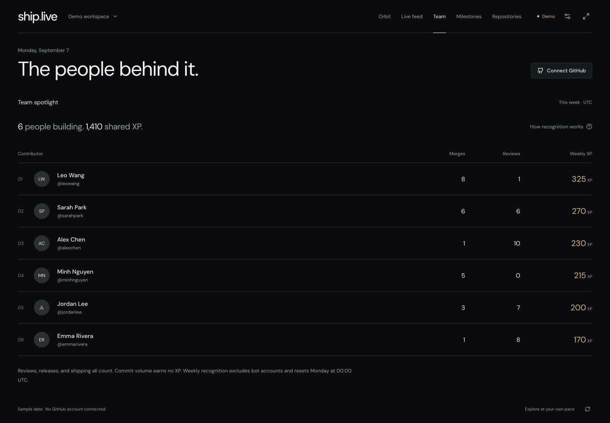
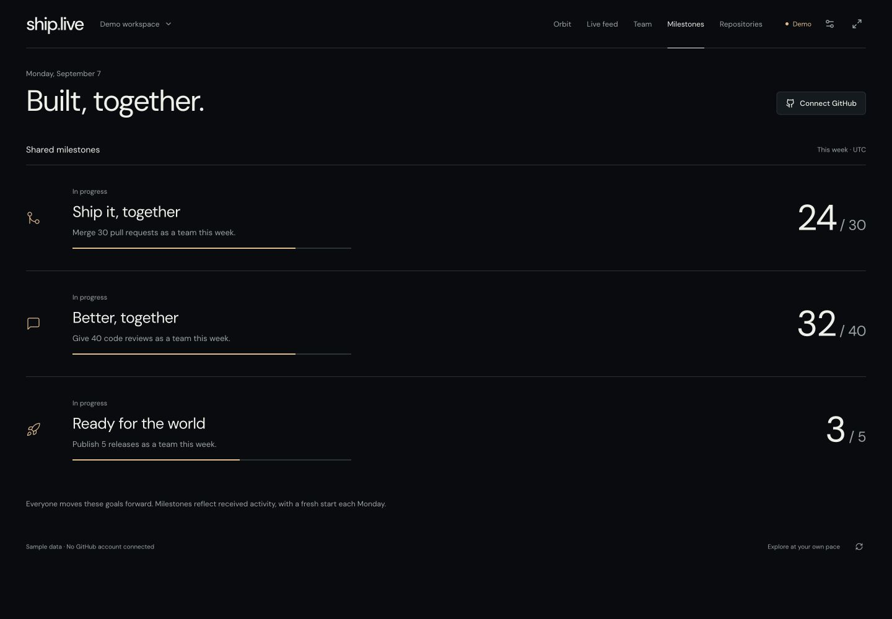

# ship.live showcase

Real screenshots of the running application, captured using the built-in fictional demo. No private repositories, tokens, or organization activity appear in these images. The dates and counters reflect the capture session, not a production deployment.

## Live team leaderboard

The dashboard pairs animated weekly contributor rankings with live GitHub activity, today’s momentum, a seven-day activity chart, and the nearest weekly milestone. New contributions highlight in the feed and announce earned XP; merges and releases launch confetti, with a larger burst when the team reaches a milestone.

Team dashboards also rotate through Review Radar, GitHub deployment state, Service Health, and the leaderboard without requiring a second workflow from the team.

## The people behind it

The contributor view makes merges, thoughtful reviews, and weekly recognition visible. Commit volume earns no XP.

## Built, together

Team milestones track shared progress toward merges, reviews, and releases during the current UTC week.

## Refreshing the screenshots

1. Run `npm run dev` and use **Demo workspace**. Disconnect any real organization before capture.
2. Capture Dashboard with all leaderboard rows visible. Use the fullscreen button to check the wall layout.
   Use **Try live activity** in demo mode to preview highlights, XP updates, rank changes, and confetti. Reloading resets simulated activity and does not replay celebrations.
3. Capture Team and Milestones at a desktop viewport with all relevant rows visible.
4. Save the unedited application screenshots into `docs/images/` with the existing filenames. Check the files visually, including contributor names and scores, before committing them.
5. Restore any temporary viewport override and confirm no private information appears in the images.

The README uses `leaderboard.jpg` as its lead image. These files can also be used in a GitHub release or project introduction.
